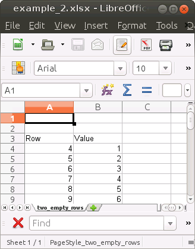
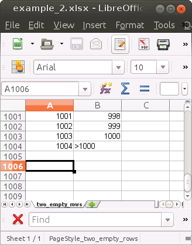

```{r setup, include = FALSE}
knitr::opts_chunk$set(
  collapse = TRUE,
  comment = "#>"
)
```

This package provides functions to read data from Microsoft Excel files. It uses
the package [readxl](https://readxl.tidyverse.org/) under the hood. In contrast
to the default behaviour of readxl the functions in this package read the raw
text information that are contained in the sheets. No type conversions are
performed and all values keep their original position. For example, a value in
cell A3 is returned in `sheet[3, 1]` with `sheet` being the result matrix
returned when reading one Excel sheet. By default, `readxl::read_excel()`
returns this value in the first row of the returned data frame, given that the
first two rows are empty. This may be useful in some cases but for validation
purposes I prefer to keep the original positions.

## Reading Table Data from a Spreadsheet Program

MS Excel is a spreadsheet program. It does not really know where a table starts
and where it ends and it does not clearly assign a type to a column. Instead,
each cell can have its own type so that there can be cells of different types in
one and the same column. However, functions such as `readxl::read_excel()` try
to communicate with Excel as if it was a database management system. For each
column the values in the first few rows of the column are inspected and the type
of the column is guessed. Then, all values in the column are tried to be
converted to the guessed type. This leads to conversion errors, e.g. if the
first few values look numeric but the column contains text values, such as
`"<1000"` further down. In the returned data frame the text values are removed,
i.e. set to `NA`. This package avoids these data losses as it keeps the original
(text) information and lets the user decide what to do.

## Read sheet with readxl

Let's check this behaviour out by reading a sheet from an example Excel file.
The top and bottom parts of the "table" contained in the sheet look as follows:

[]()
[]()

We start by reading this sheet with the `read_excel()` function from the readxl
package:

```{r}
# Path to example Excel file
file <- system.file("extdata/example_2.xlsx", package = "kwb.readxl")

# Read the first sheet with readxl::read_excel
data <- readxl::read_excel(file)

# The first empty rows were skipped and both columns are numeric (double)
head(data)
```

As described above, the two empty rows on top were skipped and the second
column was assumed to be of numeric type even though it contains a text value
in row 1004 (see image above).

## Read sheet with kwb.readxl

Now let's read the same sheet with `get_raw_text_from_xlsx()` from this package:

```{r}
# Read the sheet into a list of character matrices
sheets <- kwb.readxl::get_raw_text_from_xlsx(file, sheets = "two_empty_rows")

# Show the first rows of the first matrix
head(sheets$sheet_01)

# Show the last rows of the first matrix
tail(sheets$sheet_01)
```

The first two empty rows are kept so that the row number in the returned matrix
corresponds to the row number in the Excel file. This is helpful if we want to
warn the user about possible problems, such as the non-numeric value in row
1004:

```{r}
# Store the text matrix in sheet
sheet <- sheets$sheet_01

# Get the number of the row containing a non-numeric value in column 2 
invalid_row <- max(which(is.na(as.numeric(sheet[, 2]))))

# Give a message to the user
cat("Dear user, please have a look at row", invalid_row, "of the sheet")
```
